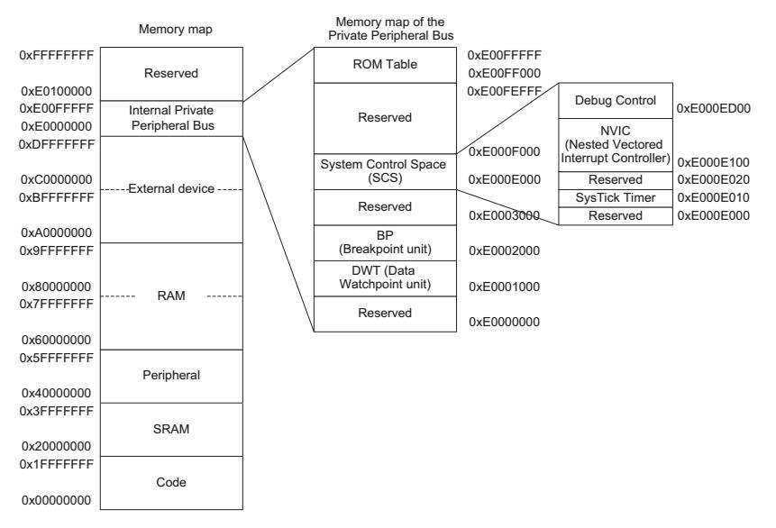

# Preguntas orientadoras

## Describa brevemente los diferentes perfiles de familias de microprocesadores/microcontroladores de ARM. Explique alguna de sus diferencias características
A lo largo de los años, ARM ha desarrollado varias familias de microprocesadores y microcontroladores con diferentes perfiles para adaptarse a diversas aplicaciones:
- **Cortex-A**: Son procesadores que están diseñados para aplicaciones de alto rendimiento, como smartphones, tabletas y sistemas embebidos avanzados. Ofrecen un rendimiento excepcional, soporte para sistemas operativos completos como Linux y Windows, y generalmente cuentan con múltiples núcleos para el procesamiento paralelo.
- **Cortex-R**: Se enfocan en aplicaciones de tiempo real y sistemas críticos, como controladores de automóviles, controladores de vuelo y sistemas de comunicación. Ofrecen tiempos de respuesta predecibles y alta confiabilidad. Suelen utilizarse en sistemas que requieren alta velocidad y seguridad.
- **Cortex-M**: Diseñados para sistemas embebidos de bajo consumo de energía y con restricciones de recursos, como microcontroladores en dispositivos IoT, sistemas de control industrial y productos de consumo. Son altamente eficientes en términos de consumo de energía y recursos. Se centran en tiempo real y eficiencia energética.

# Cortex M

## Describa brevemente las diferencias entre las familias de procesadores Cortex M0, M3 y M4

Las familias de procesadores M0, M3 y M4 son parte de la serie Cortex-M de ARM, diseñadas específicamente para aplicaciones embebidas de bajo consumo de energía.

**Arquitectura ARM**:
- **Cortex-M0:** Utiliza la arquitectura ARMv6-M, que es una arquitectura de 32 bits de Von Neumann.
- **Cortex-M3 y Cortex-M4:** Emplea la arquitectura ARMv7-M, que es una arquitectura de 32 bits de Harvard con un conjunto de instrucciones más amplio.

**Arquitectura de Memoria**:
- **Cortex-M0:** Utiliza una arquitectura de memoria unificada (Von Neumann), donde se comparte una única memoria para instrucciones y datos.
- **Cortex-M3 y Cortex-M4:** Utilizan arquitecturas de memoria separada (Harvard), con memorias separadas para instrucciones y datos, lo que permite un acceso más rápido a ambas.

**Systick Timer**:
- **Cortex-M0:** Tiene soporte para el temporizador Systick, que se utiliza para generar interrupciones periódicas y para medir el tiempo.
- **Cortex-M3 y Cortex-M4:** Contienen el temporizador Systick ya incluidos.

**División por Hardware**:
- **Cortex-M0:** Generalmente, no incluye instrucciones de división por hardware, lo que significa que las operaciones de división son emuladas por software.
- **Cortex-M3 y Cortex-M4:** Suelen incluir instrucciones de división por hardware, lo que permite realizar operaciones de división de manera más eficiente.

**Extensiones DSP**:
- **Cortex-M0:** No incluye extensiones DSP (Procesamiento de Señales Digitales) en su arquitectura.
- **Cortex-M3:** Por lo general, no incluye extensiones DSP en su arquitectura estándar, pero algunas implementaciones pueden incluir extensiones personalizadas para operaciones DSP.
- **Cortex-M4:** Incluye extensiones DSP en su arquitectura, lo que lo hace ideal para aplicaciones de procesamiento de señales y matemáticas complejas, como filtros y transformadas.

## ¿Por qué se dice que el set de instrucciones Thumb permite mayor densidad de código?
Se dice que el conjunto de instrucciones Thumb permite una mayor densidad de código por varias razones:
1. Longitud de las instrucciones: En Thumb, las instrucciones son generalmente más cortas que en el conjunto de instrucciones ARM completo. Las instrucciones Thumb suelen ser de 16 bits de longitud, mientras que las instrucciones ARM pueden ser de 32 bits. Esto significa que se necesita menos espacio de memoria para almacenar el mismo programa en Thumb en comparación con ARM.
2. Menos ciclos de reloj por instrucción: Las instrucciones Thumb a menudo requieren menos ciclos de reloj para ejecutarse en comparación con sus contrapartes ARM.
3. Menor consumo de memoria: Debido a que las instrucciones Thumb son más cortas, ocupan menos espacio en la memoria, lo que es beneficioso para sistemas con limitaciones de memoria, como sistemas integrados y dispositivos móviles.
4. Reducción del tráfico de memoria: Con un código más compacto, hay menos necesidad de acceder a la memoria principal para buscar instrucciones, lo que puede reducir el consumo de energía y mejorar la eficiencia del sistema.

## ¿Qué entiende por arquitectura load-store? ¿Qué tipo de instrucciones no posee este tipo de arquitectura?
La arquitectura load-store (carga-almacenamiento) es un diseño de arquitectura de computadora que se caracteriza por restringir las operaciones de acceso a la memoria principal (RAM) solo a un conjunto específico de instrucciones, llamadas instrucciones de carga (load) y almacenamiento (store). En una arquitectura load-store, las operaciones aritméticas y lógicas se realizan solo en registros del procesador, y no se pueden realizar directamente en la memoria.

## ¿Cómo es el mapa de memoria de la familia?

Al tratarse de una arquitectura de 32 bits, es posible direccionar $2^{32} - 1$ posiciones de memoria (4Gb). A continuación se presenta un grafico con el mapa de memeria:

