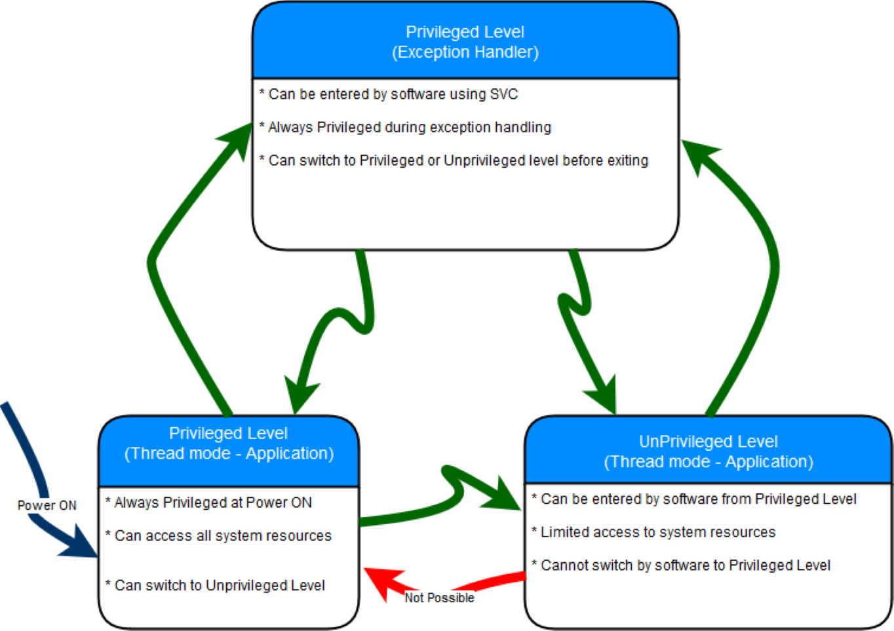

# Preguntas orientadoras

## 1 - Describa brevemente los diferentes perfiles de familias de microprocesadores/microcontroladores de ARM. Explique alguna de sus diferencias características
A lo largo de los años, ARM ha desarrollado varias familias de microprocesadores y microcontroladores con diferentes perfiles para adaptarse a diversas aplicaciones:
- **Cortex-A**: Son procesadores que están diseñados para aplicaciones de alto rendimiento, como smartphones, tabletas y sistemas embebidos avanzados. Ofrecen un rendimiento excepcional, soporte para sistemas operativos completos como Linux y Windows, y generalmente cuentan con múltiples núcleos para el procesamiento paralelo.
- **Cortex-R**: Se enfocan en aplicaciones de tiempo real y sistemas críticos, como controladores de automóviles, controladores de vuelo y sistemas de comunicación. Ofrecen tiempos de respuesta predecibles y alta confiabilidad. Suelen utilizarse en sistemas que requieren alta velocidad y seguridad.
- **Cortex-M**: Diseñados para sistemas embebidos de bajo consumo de energía y con restricciones de recursos, como microcontroladores en dispositivos IoT, sistemas de control industrial y productos de consumo. Son altamente eficientes en términos de consumo de energía y recursos. Se centran en tiempo real y eficiencia energética.

# Cortex M

## 1 - Describa brevemente las diferencias entre las familias de procesadores Cortex M0, M3 y M4

Las familias de procesadores M0, M3 y M4 son parte de la serie Cortex-M de ARM, diseñadas específicamente para aplicaciones embebidas de bajo consumo de energía.

**Arquitectura ARM**:
- **Cortex-M0:** Utiliza la arquitectura ARMv6-M, que es una arquitectura de 32 bits de Von Neumann.
- **Cortex-M3 y Cortex-M4:** Emplea la arquitectura ARMv7-M, que es una arquitectura de 32 bits de Harvard con un conjunto de instrucciones más amplio.

**Arquitectura de Memoria**:
- **Cortex-M0:** Utiliza una arquitectura de memoria unificada (Von Neumann), donde se comparte una única memoria para instrucciones y datos.
- **Cortex-M3 y Cortex-M4:** Utilizan arquitecturas de memoria separada (Harvard), con memorias separadas para instrucciones y datos, lo que permite un acceso más rápido a ambas.

**Systick Timer**:
- **Cortex-M0:** Tiene soporte para el temporizador Systick, que se utiliza para generar interrupciones periódicas y para medir el tiempo.
- **Cortex-M3 y Cortex-M4:** Contienen el temporizador Systick ya incluidos.

**División por Hardware**:
- **Cortex-M0:** Generalmente, no incluye instrucciones de división por hardware, lo que significa que las operaciones de división son emuladas por software.
- **Cortex-M3 y Cortex-M4:** Suelen incluir instrucciones de división por hardware, lo que permite realizar operaciones de división de manera más eficiente.

**Extensiones DSP**:
- **Cortex-M0:** No incluye extensiones DSP (Procesamiento de Señales Digitales) en su arquitectura.
- **Cortex-M3:** Por lo general, no incluye extensiones DSP en su arquitectura estándar, pero algunas implementaciones pueden incluir extensiones personalizadas para operaciones DSP.
- **Cortex-M4:** Incluye extensiones DSP en su arquitectura, lo que lo hace ideal para aplicaciones de procesamiento de señales y matemáticas complejas, como filtros y transformadas.

## 2 - ¿Por qué se dice que el set de instrucciones Thumb permite mayor densidad de código?
Se dice que el conjunto de instrucciones Thumb permite una mayor densidad de código por varias razones:
1. Longitud de las instrucciones: En Thumb, las instrucciones son generalmente más cortas que en el conjunto de instrucciones ARM completo. Las instrucciones Thumb suelen ser de 16 bits de longitud, mientras que las instrucciones ARM pueden ser de 32 bits. Esto significa que se necesita menos espacio de memoria para almacenar el mismo programa en Thumb en comparación con ARM.
2. Menos ciclos de reloj por instrucción: Las instrucciones Thumb a menudo requieren menos ciclos de reloj para ejecutarse en comparación con sus contrapartes ARM.
3. Menor consumo de memoria: Debido a que las instrucciones Thumb son más cortas, ocupan menos espacio en la memoria, lo que es beneficioso para sistemas con limitaciones de memoria, como sistemas integrados y dispositivos móviles.
4. Reducción del tráfico de memoria: Con un código más compacto, hay menos necesidad de acceder a la memoria principal para buscar instrucciones, lo que puede reducir el consumo de energía y mejorar la eficiencia del sistema.

## 3 - ¿Qué entiende por arquitectura load-store? ¿Qué tipo de instrucciones no posee este tipo de arquitectura?
La arquitectura load-store (carga-almacenamiento) es un diseño de arquitectura de computadora que se caracteriza por restringir las operaciones de acceso a la memoria principal (RAM) solo a un conjunto específico de instrucciones, llamadas instrucciones de carga (load) y almacenamiento (store). En una arquitectura load-store, las operaciones aritméticas y lógicas se realizan solo en registros del procesador, y no se pueden realizar directamente en la memoria.

## 4 - ¿Cómo es el mapa de memoria de la familia?

Al tratarse de una arquitectura de 32 bits, es posible direccionar $2^{32} - 1$ posiciones de memoria (4Gb). A continuación se presenta un grafico con el mapa de memeria:


## 5 - ¿Qué ventajas presenta el uso de los "shadowed pointers" del PSP y el MSP?

- PSP (Process Stack Pointer): El PSP es un puntero de pila que se utiliza para gestionar la pila de una tarea específica en un sistema multitarea en tiempo real. Cada tarea tiene su propio PSP para mantener su contexto de ejecución.

- MSP (Main Stack Pointer): El MSP es otro puntero de pila que se utiliza para gestionar la pila principal del sistema. Se utiliza principalmente para manejar interrupciones y cambios de contexto entre tareas. El MSP es manejado por el sistema operativo.

Los shadowed pointers permiten:

1. Cambio rápido de contexto: Los *shadowed pointers* permiten un cambio rápido y eficiente entre el stack de usuario y la pila principal. Esto es esencial en sistemas multitarea en tiempo real donde es necesario cambiar rápidamente de una tarea a otra.
2. Soporte para interrupciones: En sistemas embebidos, es común manejar interrupciones. Los *shadowed pointers* facilitan la transición de una tarea a una rutina de interrupción y viceversa, garantizando que el contexto de la tarea original se restaure después de que se maneje la interrupción.

## 6 - Describa los diferentes modos de privilegio y operación del Cortex M, sus relaciones y como se conmuta de uno al otro. Describa un ejemplo en el que se pasa del modo privilegiado a no priviligiado y nuevamente a privilegiado.

Cortex-M de ARM utiliza un modelo de seguridad y protección de recursos basado en modos de privilegio y operación para garantizar la ejecución segura y eficiente de tareas en sistemas embebidos. Los modos de operación en Cortex-M incluyen:

1. Handler Mode (Modo de Manejador): Este modo se utiliza para manejar interrupciones y excepciones. Cuando ocurre una interrupción, el procesador cambia a Handler Mode para ejecutar el código de la rutina de manejo de interrupciones.
2. Privileged Mode (Modo con Privilegios): En este modo, el procesador tiene acceso completo a todas las instrucciones y registros, similar al Thread Mode. Sin embargo, el Privileged Mode se utiliza para ejecutar código con un nivel de privilegio superior, como el kernel de un sistema operativo en sistemas que lo requieran. Se puede acceder al Privileged Mode desde el Thread Mode o el Handler Mode.
3. Unprivileged Mode (Modo sin Privilegios): En este modo, el procesador tiene restricciones en el acceso a ciertos recursos y privilegios, lo que ayuda a implementar la separación entre aplicaciones y sistemas en tiempo real. El código se ejecuta en este modo cuando se asigna un nivel de privilegio inferior a una tarea o proceso. El Unprivileged Mode es una característica de seguridad que puede ayudar a evitar que un código malicioso acceda a recursos críticos.



La conmutación entre estos modos se logra mediante instrucciones de excepción, como las instrucciones `SVC` (*Supervisor Call*) para cambiar al Privileged Mode desde el Thread Mode o las interrupciones que cambian al Handler Mode cuando ocurre una interrupción. La conmutación también puede ser administrada por un sistema operativo en sistemas más avanzados.

Un ejemplo de cambio de privilegio se dá con el uso de sistemas operativos de tiempo real, los cuales corren su kernel en modo privilegiado para contralar todos los recursos del procesador, mientras que las tareas del usuarios se ejecutan en modo sin-privilegios.


## 7 - ¿Qué se entiende por modelo de registros ortogonal? Dé un ejemplo

El término "modelo de registros ortogonal" se refiere a una característica de algunas arquitecturas de procesadores donde los registros generales están diseñados de manera que puedan ser utilizados de manera intercambiable en una amplia variedad de instrucciones sin restricciones específicas en su uso. En un modelo de registros ortogonal, los registros pueden ser operados y direccionados de manera uniforme, lo que simplifica la programación y permite una mayor flexibilidad en la ejecución de instrucciones.

Un ejemplo de registros ortogonales es cualquier arquitectura que posea registros de propósitos generales. (General-Purpose Registers) que se pueden utilizar para una amplia variedad de tareas.

```asm

; Ejemplo de manipulación de registros de propositos generales
; Supongamos que R0, R1 y R2 son registros generales disponibles

; Sumar R1 y R2 y almacenar el resultado en R0
ADD R0, R1, R2

; Multiplicar R2 por 5 y almacenar el resultado en R1
MOV R3, #5       ; Cargar el valor 5 en R3
MUL R1, R2, R3   ; Multiplicar R2 por R3 y almacenar el resultado en R1

; Comparar R0 con un valor inmediato y establecer una bandera
CMP R0, #10      ; Comparar R0 con el valor 10

```

## 8 - ¿Qué ventajas presenta el uso de intrucciones de ejecución condicional (IT)? Dé un ejemplo

Las instrucciones de ejecución condicional (IT, por sus siglas en inglés, *If-Then*) son una característica que permiten ejecutar instrucciones condicionalmente. Esto permite:

1. Ahorro de espacio de código: Las instrucciones de ejecución condicional pueden reducir la cantidad de código necesaria para implementar lógica condicional en comparación con utilizar instrucciones de salto (branch) condicional. Esto puede llevar a un código más compacto y eficiente en términos de memoria.
2. Mejora del rendimiento: Al evitar saltos condicionales (branch), que pueden causar desviaciones en el flujo de ejecución y afectar negativamente el rendimiento de la canalización (pipeline) del procesador, las instrucciones de ejecución condicional pueden ayudar a mantener un flujo de ejecución más predecible y un rendimiento más consistente.
3. Programación más legible: Las instrucciones de ejecución condicional pueden hacer que el código sea más fácil de entender y mantener, ya que la lógica condicional se expresa de manera más directa y se alinea visualmente con la instrucción que se va a ejecutar.


```asm
; Ejemplo en lenguaje ensamblador Cortex-M con instrucciones IT
CMP  R0, #10      ; Compara el valor en R0 con 10
IT   GT           ; Si R0 es mayor que 10, las próximas instrucciones serán condicionales

ADD R1, R2, #2  ; Suma R2 y ${2} y almacena el resultado en R1 si R0 > 10
```

## 9 - Describa brevemente las excepciones más prioritarias (reset, NMI, Hardfault).

1. **Reset**: La excepción de reinicio (Reset) es la más prioritaria y se produce cuando el procesador se inicia o se reinicia. Esta excepción es invocada al encender o reiniciar el sistema y establece el estado inicial del procesador y la ejecución del programa comienza desde una dirección de memoria específica, generalmente la dirección de inicio del programa (vector de reinicio).

2. **NMI (Non-Maskable Interrupt)**: La excepción de interrupción no enmascarable es la segunda más prioritaria después del reinicio. Es una interrupción que no puede ser deshabilitada o enmascarada por el software y se utiliza para manejar eventos críticos que deben ser atendidos inmediatamente, como eventos de seguridad o fallos de hardware.

3. **Hard Fault**: La excepción de fallo grave (Hard Fault) es una excepción de alta prioridad que se genera cuando ocurre un error grave en la ejecución del programa, como una violación de acceso a memoria o una instrucción no válida. Puede ser causada por problemas de software o hardware. El Hard Fault es un mecanismo de seguridad que ayuda a proteger el sistema contra comportamientos inesperados.


## 10 - Describa las funciones principales de la pila. ¿Cómo resuelve la arquitectura el llamado a funciones y su retorno?

La pila cumple cuatro funciones principalmente:

1. **Almacenamiento temporal de datos**: La pila se utiliza para almacenar temporalmente datos, como valores de registros, direcciones de retorno y variables locales, durante la ejecución de una función o una rutina.

2. **Gestión de llamadas a funciones**: La pila se utiliza para administrar la secuencia de llamadas a funciones y el retorno de estas funciones. Cada vez que se llama a una función, su estado actual, como los registros y la dirección de retorno, se almacena en la pila para que la función pueda ejecutarse y, posteriormente, restaurar su estado cuando regresa.

3. **Almacenamiento de contexto de interrupciones**: La pila se utiliza para almacenar el contexto actual del procesador cuando ocurre una interrupción o una excepción. Esto permite que el procesador atienda la interrupción y, una vez completada, regrese al punto donde se interrumpió.

4. **Gestión de variables locales**: Las variables locales, que son específicas de una función, se almacenan en la pila para que estén disponibles durante la ejecución de la función. Esto garantiza que cada instancia de la función tenga su propia área de almacenamiento para sus variables locales.


El proceso de llamado de funciones se puede dividir en tres grandes etapas:

1. **Llamada a función**: Cuando se llama a una función, se almacenan en la pila los valores de los registros que puedan ser modificados por la función llamada, así como la dirección de retorno, que es la dirección de la instrucción siguiente a la llamada a la función. Luego, se ajusta el puntero de pila (stack pointer) para reservar espacio para estos datos en la parte superior de la pila.
2. **Ejecución de la función**: La función se ejecuta utilizando los registros y los datos almacenados en la pila. Las variables locales de la función también se almacenan en la pila y se acceden desde allí durante la ejecución de la función.
3. **Retorno de función**: Cuando la función termina su ejecución, se restaura el estado original almacenado en la pila, incluyendo los valores de los registros y la dirección de retorno. puntero de pila se ajusta nuevamente para eliminar los datos de la función de la pila.

## 11 - Describa la secuencia de reset del microprocesador.

La secuencia de reset es una tarea compleja la cual está dividida en multiple etapas:

1. **Alimentación o reinicio del sistema**: El proceso de reset comienza cuando se aplica alimentación eléctrica al microprocesador (por ejemplo, al encender el dispositivo) o cuando se genera un reinicio del sistema.

2. **Inicialización del hardware**: En esta etapa, los circuitos internos del microprocesador se inicializan y configuran para un estado conocido y predecible. Esto puede incluir la configuración de relojes, registros internos, y otros componentes.

3. **Carga de vectores de reinicio**: Los microprocesadores Cortex-M utilizan una tabla de vectores de interrupción para determinar cómo se manejan las interrupciones y las excepciones, incluido el vector de reinicio. En esta etapa, se cargan los valores de los vectores de reinicio que apuntan a las direcciones iniciales de las rutinas de manejo de reinicio.

4. **Configuración de registros de pila**: Se establece el puntero de pila (Stack Pointer, SP) en una ubicación válida de memoria. El valor del SP puede provenir de una ubicación específica de memoria o estar predefinido en el hardware. La pila se utiliza para almacenar datos temporales y registros de contexto durante la ejecución del programa.

5. **Salto a la dirección de reinicio**: Una vez que todos los ajustes iniciales se han realizado y los vectores de reinicio están configurados, el microprocesador realiza un salto a la dirección de reinicio. La dirección de reinicio suele ser la primera entrada en la tabla de vectores de interrupción, que apunta a la rutina de manejo de reinicio.

6. **Ejecución de la rutina de manejo de reinicio**: La rutina de manejo de reinicio (Reset Handler) se encarga de inicializar variables, configurar periféricos y llevar a cabo tareas necesarias para poner el sistema en un estado coherente y prepararlo para la ejecución del programa principal.

7. **Llamada al programa principal**: Una vez que la rutina de manejo de reinicio ha realizado todas las tareas necesarias, puede llamar al programa principal (main) o a la aplicación principal del dispositivo.

## 12 - ¿Qué entiende por "core peripherals"? ¿Qué diferencia existe entre estos y el resto de los periféricos?

Los "core peripherals" (periféricos centrales) se refieren a un conjunto de periféricos esenciales y fundamentales que están directamente relacionados con el funcionamiento central de un microcontrolador o microprocesador. Estos periféricos son críticos para el funcionamiento básico y la comunicación con el núcleo del procesador. A menudo, están integrados en el diseño del microcontrolador o microprocesador y son esenciales para su operación.

Las principales diferencias entre los "core peripherals" y el resto de los periféricos son las siguientes:

1. **Importancia fundamental**: Los "core peripherals" son periféricos críticos y fundamentales sin los cuales el microcontrolador o microprocesador no puede funcionar de manera adecuada. Estos periféricos a menudo incluyen el temporizador del sistema, el controlador de interrupciones, el controlador de interrupciones de excepciones, el sistema de gestión de energía y el bus de acceso a memoria.
2. **Integración central**: Los "core peripherals" suelen estar integrados directamente en el chip del microcontrolador o microprocesador. Esto significa que están disponibles de manera predeterminada y están siempre presentes en el dispositivo, sin necesidad de componentes externos adicionales.
3. **Interfaz con el núcleo del procesador**: Los "core peripherals" a menudo interactúan directamente con el núcleo del procesador, permitiendo funciones críticas como el inicio y la detención del procesador, la gestión de excepciones y el acceso a la memoria.

## 13 - ¿Cómo se implementan las prioridades de las interrupciones? Dé un ejemplo

Cortex-M implementa mediante un sistema de prioridades que permite asignar niveles de prioridad a las diferentes fuentes de interrupción. Este sistema de prioridades permite que las interrupciones se manejen en el orden adecuado según su importancia. Dicho sistema es llamado NVIC (Nested Vectored Interrupt Controller) que es un controlador de interrupciones integrado responsable de administrar y priorizar las interrupciones. Cada fuente de interrupción se asigna a un número de canal de interrupción (IRQ) específico. El NVIC permite asignar un nivel de prioridad a cada canal de interrupción. Los niveles de prioridad generalmente se dividen en grupos predefinidos, donde el nivel 0 es el más alto y el nivel n es el más bajo, siendo n el número de niveles de prioridad disponibles.

## 14 - ¿Qué es el CMSIS? ¿Qué función cumple? ¿Quién lo provee? ¿Qué ventajas aporta?

CMSIS (Cortex Microcontroller Software Interface Standard) es una especificación y una colección de bibliotecas de software desarrolladas por ARM para simplificar y unificar el desarrollo de software para microcontroladores basados en la arquitectura Cortex-M.

La función principal de CMSIS es proporcionar una capa de abstracción de hardware y una interfaz estandarizada para el acceso a los recursos y las características de los microcontroladores Cortex-M, como los registros de periféricos, las interrupciones, los temporizadores y más. CMSIS facilita el desarrollo de software para microcontroladores al proporcionar una API coherente y portátil que puede utilizarse en múltiples dispositivos Cortex-M de diferentes fabricantes.

Las ventajas que aporta CMSIS incluyen:

1. **Facilita el desarrollo**: CMSIS simplifica y acelera el desarrollo de software para microcontroladores al proporcionar una interfaz coherente y portátil.

2. **Portabilidad**: Permite escribir código que se puede reutilizar en diferentes microcontroladores Cortex-M, lo que ahorra tiempo y esfuerzo.

3. **Eficiencia**: CMSIS ofrece acceso eficiente a los recursos de hardware, lo que es esencial para el desarrollo de sistemas embebidos con restricciones de recursos.

4. **Mantenimiento más sencillo**: Al seguir una interfaz estandarizada, el código es más fácil de mantener y actualizar a medida que cambian los microcontroladores.

## 15 - Cuando ocurre una interrupción, asumiendo que está habilitada ¿Cómo opera el microprocesador para atender a la subrutina correspondiente? Explique con un ejemplo

Cuando ocurre una interrupción y está habilitada, el microprocesador opera siguiendo un conjunto de pasos para atender a la subrutina correspondiente. Estos pasos son típicos en la mayoría de las arquitecturas de microcontroladores y microprocesadores.

Supongamos que estamos trabajando ejecutando un código y se produce una interrupción externa, como una señal de un botón que indica una solicitud de interrupción. Vamos a asumir que la interrupción ha sido habilitada y priorizada correctamente.

1. **Detección de la interrupción**: Cuando ocurre la interrupción, el microprocesador primero detecta la solicitud de interrupción. Esto puede ser una señal de hardware que se activa cuando se presiona el botón en nuestro ejemplo.

2. **Guardar estado actual**: Antes de saltar a la rutina de manejo de interrupción, el microprocesador debe guardar su estado actual. Esto implica guardar los valores de los registros que se están utilizando en la ejecución actual del programa, así como la dirección de retorno, para que una vez que se maneje la interrupción, se pueda regresar al punto exacto donde se interrumpió. Estos valores se almacenan en la pila.

3. **Determinar la fuente de la interrupción**: El microprocesador debe determinar qué tipo de interrupción ha ocurrido. En nuestro ejemplo, se podría verificar si la interrupción provino del botón o de otra fuente.

4. **Buscar la dirección de la rutina de manejo de interrupción**: Cada fuente de interrupción tiene asociada una dirección de inicio de la rutina de manejo de interrupción correspondiente. El microprocesador accede a esta dirección a través de un vector de interrupción o una tabla de vectores. En el caso de Cortex-M, esto se maneja a través del NVIC (Nested Vectored Interrupt Controller).

5. **Ejecutar la rutina de manejo de interrupción**: El microprocesador salta a la dirección de la rutina de manejo de interrupción y comienza a ejecutar las instrucciones en esa ubicación. La rutina de manejo de interrupción realiza las tareas necesarias para responder a la interrupción. En nuestro ejemplo, podría ser el procesamiento del botón, como cambiar el estado de un LED.

6. **Restaurar estado anterior**: Una vez que se ha completado la rutina de manejo de interrupción, se restaura el estado anterior del microprocesador. Los valores de los registros y la dirección de retorno se recuperan desde la pila.

7. **Retorno de la interrupción**: El microprocesador ejecuta una instrucción de retorno de interrupción (RET o RETI) que lo lleva de vuelta al punto donde se interrumpió originalmente. El programa principal continúa su ejecución desde este punto.

## 16 - ¿Cómo cambia la operación de stacking al utilizar la unidad de punto flotante?

Al utilizar la unidad de punto flotante (FPU) en Cortex-M, se añaden registros de punto flotante adicionales, se utilizan instrucciones de carga y almacenamiento específicas para la FPU, y se gestiona un stack frame de punto flotante adicional para preservar el contexto de punto flotante durante excepciones e interrupciones. Esto permite realizar operaciones de punto flotante de manera eficiente y garantiza la integridad del contexto de punto flotante en el entorno de interrupciones y excepciones.

## 17 - Explique las características avanzadas de atención a interrupciones: tail chaining y late arrival.

Son utilizados en algunos controladores de interrupciones para mejorar la eficiencia y la capacidad de respuesta del sistema ante múltiples interrupciones. Estas características permiten que el procesador maneje interrupciones de manera más eficiente y flexible.

1. **Tail Chaining (Encadenamiento de Cola)**:

   - **Definición**: El tail chaining es una característica que permite que múltiples interrupciones se manejen en secuencia sin la necesidad de que el procesador regrese al estado normal entre cada interrupción.

   - **Funcionamiento**: Cuando se habilita el tail chaining, el procesador puede iniciar la ejecución de una nueva rutina de manejo de interrupción tan pronto como finaliza la primera, sin salir completamente del contexto de interrupción. Esto ahorra tiempo y ciclos de procesador que se gastarían en restaurar y guardar todo el contexto de interrupción entre cada interrupción.

   - **Ventajas**: El tail chaining es útil en situaciones en las que se generan múltiples interrupciones en rápida sucesión. Permite un manejo más eficiente de las interrupciones y reduce la latencia en la respuesta del sistema a eventos críticos.

2. **Late Arrival (Llegada Tardía)**:

   - **Definición**: El late arrival es una característica que permite que una interrupción se maneje incluso si ocurre después de que otra interrupción haya comenzado a ejecutarse.

   - **Funcionamiento**: En sistemas que admiten late arrival, si una interrupción se activa mientras se está manejando otra interrupción, la nueva interrupción se encola y se maneja tan pronto como termine la interrupción actual en lugar de descartarse o ignorarse.

   - **Ventajas**: El late arrival es útil cuando las interrupciones son de naturaleza crítica y no pueden permitirse perderse, incluso si se generan mientras se maneja otra interrupción. Esto asegura que todas las interrupciones se manejen adecuadamente y se reduce el riesgo de pérdida de eventos importantes.

## 18 - ¿Qué es el systick? ¿Por qué puede afirmarse que su implementación favorece la portabilidad de los sistemas operativos embebidos?

El "SysTick" es un temporizador o contador de sistema. Su principal propósito es proporcionar una fuente de temporización precisa que puede utilizarse para diversas tareas en sistemas embebidos. Debido a su independencia del hardware subyacente y a la consistencia en su funcionalidad entre los dispositivos Cortex-M, el SysTick es una herramienta importante para los sistemas operativos embebidos. Los sistemas operativos en tiempo real (RTOS) y otros componentes de software pueden aprovechar el SysTick como una fuente confiable y portátil de temporización. Los desarrolladores de sistemas operativos pueden escribir código que sea compatible con una variedad de microcontroladores Cortex-M sin tener que preocuparse por detalles de temporización específicos del hardware.

## 19 - ¿Qué funciones cumple la unidad de protección de memoria (MPU)?

La Unidad de Protección de Memoria (MPU, por sus siglas en inglés, Memory Protection Unit) cumple varias funciones clave relacionadas con la protección de la memoria y la seguridad en sistemas embebidos. Estas funciones incluyen:

1. **Segmentación de Memoria**: La MPU permite dividir la memoria del sistema en regiones o segmentos con características de acceso específicas. Cada región de memoria puede configurarse con permisos de acceso individuales, como lectura, escritura y ejecución. Esto proporciona una forma de aislar y proteger diferentes áreas de la memoria del sistema.

2. **Control de Acceso**: La MPU controla el acceso a la memoria mediante el uso de reglas de acceso específicas. Estas reglas definen quién puede acceder a una región de memoria en particular y qué tipo de acceso está permitido. Por ejemplo, se puede configurar para permitir que ciertos procesos o aplicaciones accedan solo a una región de memoria específica mientras se les niega el acceso a otras regiones.

3. **Protección de Código**: La MPU puede utilizarse para proteger el código ejecutable en la memoria contra escritura o ejecución no autorizada. Esto es útil para prevenir modificaciones maliciosas o accidentalmente dañinas en el código del sistema.

4. **Protección de Datos Sensibles**: Se puede utilizar la MPU para proteger datos sensibles almacenados en la memoria contra el acceso no autorizado. Esto es crítico en aplicaciones de seguridad y protección de datos, como sistemas de pago, dispositivos médicos y sistemas de control industrial.

5. **Aislamiento de Procesos**: La MPU permite el aislamiento de procesos o aplicaciones en sistemas operativos en tiempo real (RTOS). Cada proceso puede tener su propia región de memoria protegida, lo que impide que un proceso acceda o modifique la memoria de otro proceso.

6. **Prevención de Desbordamientos de Pila**: La MPU puede utilizarse para prevenir desbordamientos de pila (stack overflow) configurando regiones de memoria para la pila y estableciendo límites de acceso. Esto ayuda a detectar y prevenir condiciones de desbordamiento de pila que podrían ser explotadas por atacantes o causar fallas en el sistema.

7. **Gestión de Excepciones**: La MPU puede generar excepciones cuando se violan las reglas de acceso configuradas. Estas excepciones pueden ser manejadas por el sistema para tomar medidas apropiadas, como generar registros de errores o detener la ejecución de una aplicación.

8. **Seguridad y Aislamiento**: En aplicaciones críticas de seguridad, como sistemas de automoción o dispositivos médicos, la MPU contribuye a garantizar que los componentes del sistema estén adecuadamente aislados y protegidos contra vulnerabilidades y ataques.

## 20 - ¿Cuántas regiones pueden configurarse como máximo? ¿Qué ocurre en caso de haber solapamientos de las regiones? ¿Qué ocurre con las zonas de memoria no cubiertas por las regiones definidas?

La cantidad máxima de regiones que se pueden configurar en la Unidad de Protección de Memoria (MPU) de un microcontrolador Cortex-M depende de la implementación específica de hardware de dicho microcontrolador. Diferentes microcontroladores pueden ofrecer diferentes cantidades de regiones configurables. En algunos casos, puede haber una limitación en el número de regiones, mientras que en otros, la cantidad de regiones puede ser más flexible y depende de la configuración.

En cuanto a solapamientos de regiones:

1. **Posibles Solapamientos**: La MPU permite definir regiones de memoria con direcciones base y límites específicos. Si no se configura adecuadamente, es posible que se produzcan solapamientos de regiones. Esto significa que una dirección de memoria específica puede estar cubierta por más de una región definida, lo que crea conflictos en las reglas de acceso.

2. **Prioridad de Regiones**: La prioridad de regiones se determina en función del orden en que se definen en la configuración de la MPU. La región definida más recientemente tiene prioridad sobre las regiones previamente definidas en caso de solapamiento. En otras palabras, si dos regiones se solapan, se aplicarán las reglas de acceso de la región más reciente.

En relación con las zonas de memoria no cubiertas por las regiones definidas:

1. **Sin Protección Específica**: Las zonas de memoria que no están cubiertas por ninguna región definida en la configuración de la MPU no tienen restricciones de acceso específicas impuestas por la MPU. En otras palabras, el acceso a estas zonas de memoria no se ve afectado por las reglas de acceso de la MPU y depende de la configuración de acceso predeterminada o del sistema operativo (si está presente).

2. **Acceso Normal**: En general, las zonas de memoria no cubiertas por regiones definidas en la MPU permiten el acceso normal según la configuración predeterminada del microcontrolador. Esto significa que se pueden leer y escribir sin restricciones a menos que se apliquen reglas de acceso adicionales a nivel de software.

## 21 - ¿Para qué se suele utilizar la excepción PendSV? ¿Cómo se relaciona su uso con el resto de las excepciones? Dé un ejemplo

La excepción PendSV (Pendable Supervisor Call) tiene como principal propósito es facilitar la planificación y el cambio de contexto de tareas en sistemas operativos en tiempo real (RTOS) y entornos multitarea. A continuación, se describen sus usos y su relación con otras excepciones:

1. **Cambio de Contexto de Tareas**: La excepción PendSV se utiliza para realizar cambios de contexto de tareas en sistemas multitarea. Cuando se produce un cambio de contexto, el estado de una tarea (registros, punteros de pila, etc.) se guarda en la pila y se restaura el estado de otra tarea para que pueda ejecutarse. Esto permite que múltiples tareas se ejecuten de manera concurrente en un sistema embebido.
2. **Planificación de Tareas**: El PendSV se activa típicamente cuando se decide cambiar de una tarea a otra según la política de planificación del sistema operativo en tiempo real. Puede ser activado manualmente por el sistema operativo o como parte de una interrupción de temporizador (por ejemplo, cuando se agota el tiempo asignado a una tarea).


La excepción PendSV se configura generalmente con la prioridad más baja en el sistema, lo que significa que puede ser interrumpida por otras excepciones de mayor prioridad. Esto permite que se realicen cambios de contexto de tareas de manera segura incluso si se activan excepciones más críticas. Esto garantiza que las tareas críticas puedan ejecutarse sin demoras excesivas debido a cambios de contexto pendientes.

En muchos sistemas, la excepción SysTick se utiliza para generar interrupciones periódicas que se utilizan para realizar cambios de contexto o activar tareas a intervalos regulares. La excepción PendSV puede coordinarse con la excepción SysTick para planificar y ejecutar cambios de contexto en momentos adecuados.

1. Tarea A se ejecuta y consume su tiempo asignado.
2. El planificador del RTOS decide que es hora de cambiar a Tarea B.
3. La excepción SysTick genera una interrupción que, al terminar, activa la excepción PendSV.
4. En PendSV, el RTOS guarda el estado de Tarea A y restaura el estado de Tarea B.
5. Tarea B comienza a ejecutarse.
6. Cuando Tarea B consume su tiempo asignado, el planificador decide cambiar a Tarea C.
7. La excepción SysTick nuevamente activa PendSV.
8. PendSV guarda el estado de Tarea B y restaura el estado de Tarea C.
9. El ciclo continúa con cambios de contexto según lo decida el planificador.

## 22 - ¿Para qué se suele utilizar la excepción SVC? Expliquelo dentro de un marco de un sistema operativo embebido.

La excepción SVC (Supervisor Call) se utiliza comúnmente en sistemas embebidos que ejecutan sistemas operativos en tiempo real (RTOS) o sistemas que requieren una transición controlada entre el modo de usuario y el modo supervisor. A continuación, se explica el propósito y el uso de la excepción SVC en el contexto de un sistema operativo embebido:

1. **Llamadas al Sistema (System Calls)**: Una de las principales aplicaciones de la excepción SVC es permitir llamadas al sistema (system calls). Las llamadas al sistema son solicitudes realizadas por un programa de usuario para acceder a servicios o recursos del sistema operativo, como la creación de tareas, la gestión de memoria, la comunicación entre procesos o la administración de archivos. Estas solicitudes se hacen mediante una instrucción especial, que genera una excepción SVC.

2. **Transición al Modo Supervisor**: Cuando ocurre una excepción SVC, el procesador cambia del modo de usuario al modo supervisor. En este modo, el sistema operativo tiene acceso a recursos privilegiados y puede realizar operaciones que no están permitidas en el modo de usuario, como acceder a registros de control y realizar tareas de administración del sistema.

3. **Gestión de Llamadas al Sistema**: El sistema operativo, que se ejecuta en modo supervisor, captura la excepción SVC y la interpreta para determinar la acción solicitada por el programa de usuario. Dependiendo del número o código de SVC específico proporcionado por el programa de usuario, el sistema operativo ejecuta la llamada al sistema correspondiente. Por ejemplo, si el programa de usuario solicita una asignación de memoria, el sistema operativo puede asignar un bloque de memoria y devolver un puntero al programa de usuario.

4. **Control de Acceso a Recursos**: La excepción SVC también permite al sistema operativo aplicar políticas de seguridad y control de acceso a recursos. El sistema operativo puede verificar si el programa de usuario tiene los privilegios necesarios para realizar la llamada al sistema solicitada y tomar medidas en consecuencia.
